This page takes inspiration and images from https://www.youngla.com/

### The challenge

Users should be able to:
- Log in and activate account from your email
- Register in the system
- See available products
- Add products to cart
- Make purchases

Admin should be able to:
- View, Add, Edit and Delete products, users, media, users
  
## Run Project
In the console, you must run the following command to install all the modules and packages necessary for the application: 
```
npm install
```

Then, if everything has been installed correctly, you can run the application with the following command: 
```
npm run dev
```

## Screenshots
### Home View
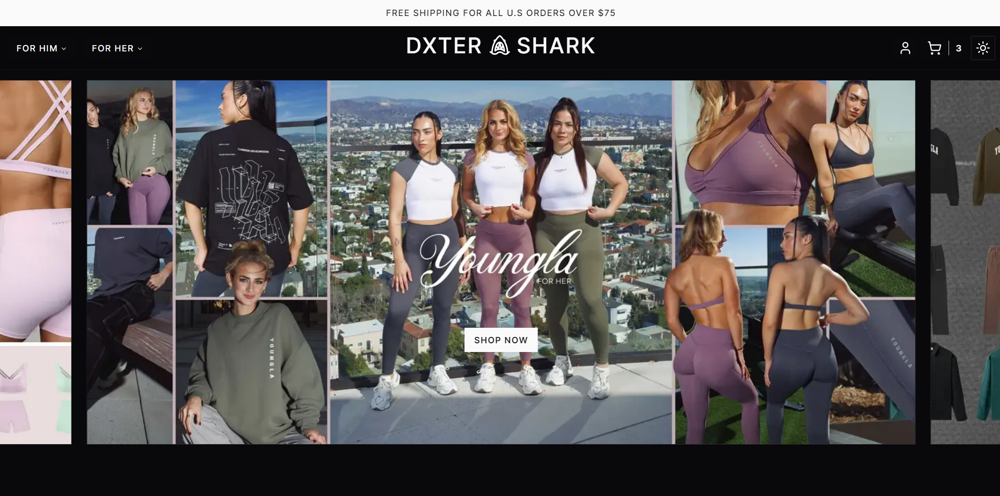
### User Home Products

### User Product Page
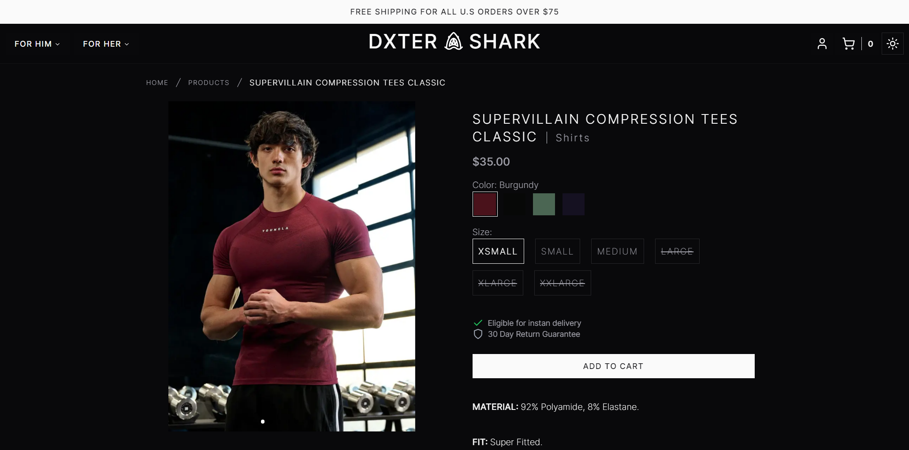
### Product Page Light Theme
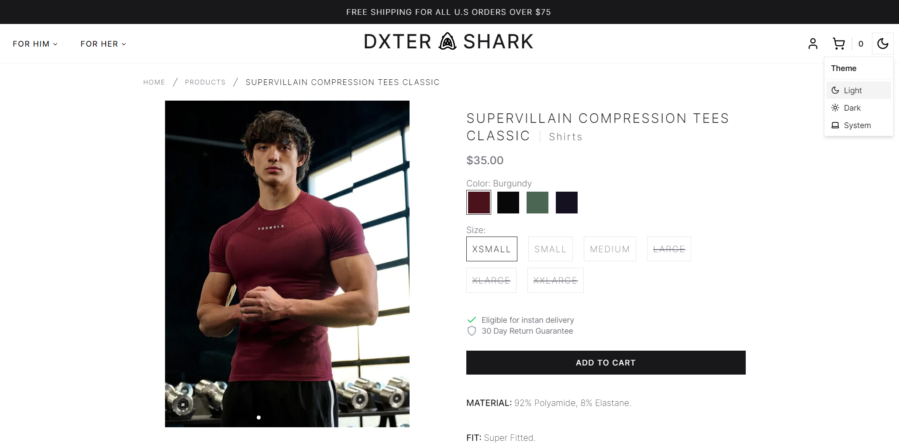
### User Cart
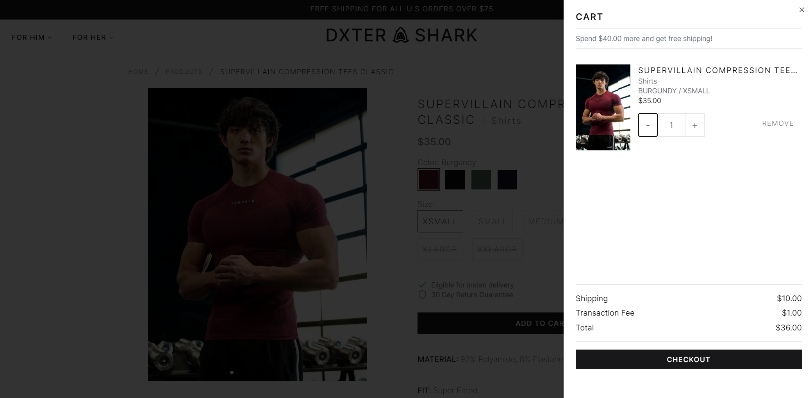
### User Login
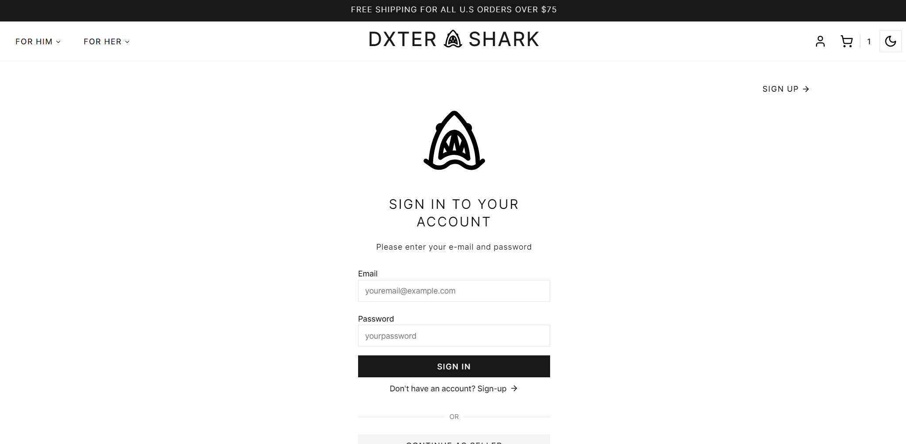
### User Sign In
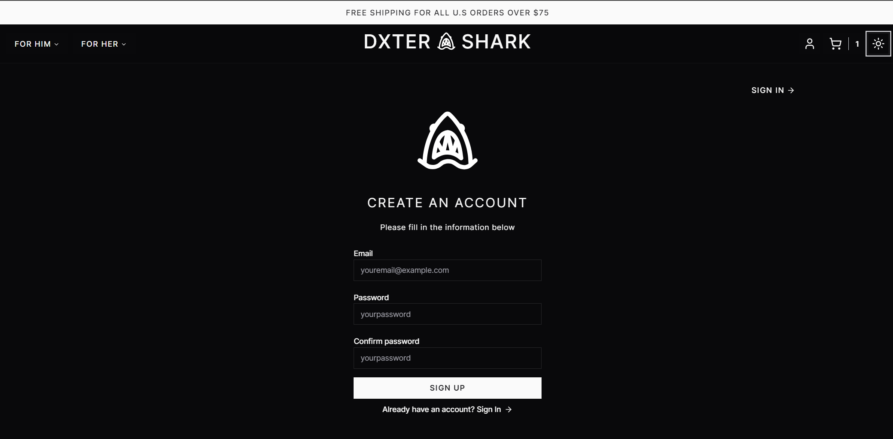
### Cart Page
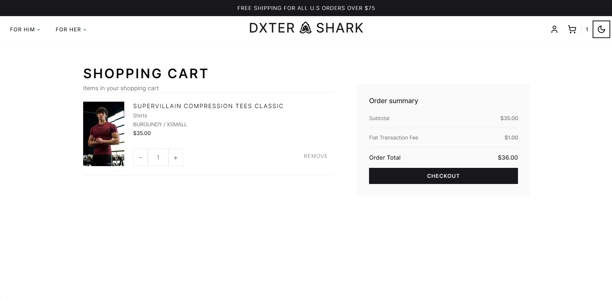
### Payment Stripe
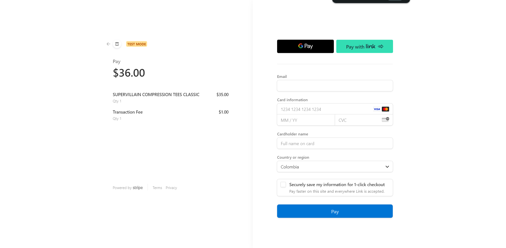
### Thank you
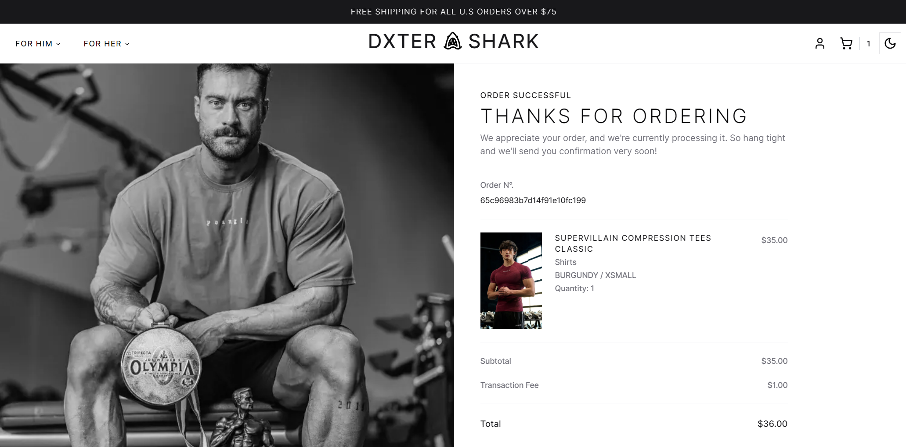
### Admin Login
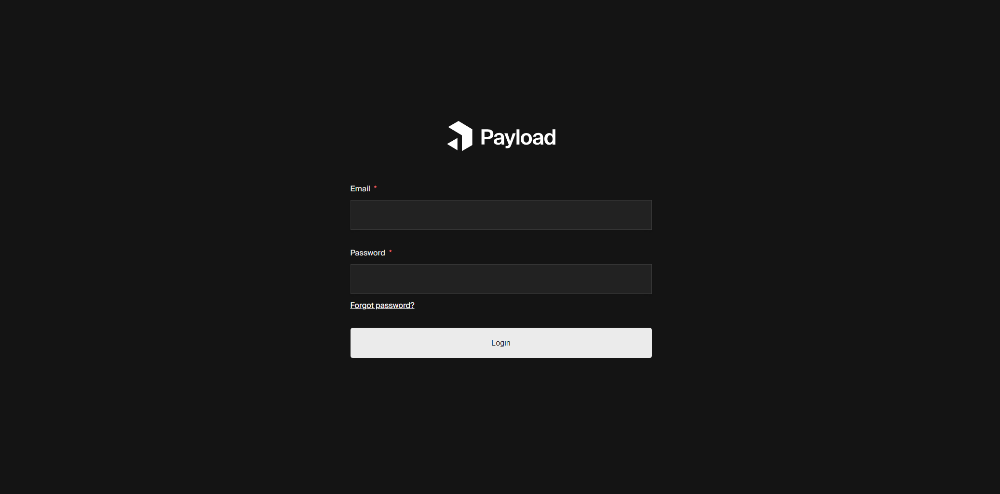
### Admin Home
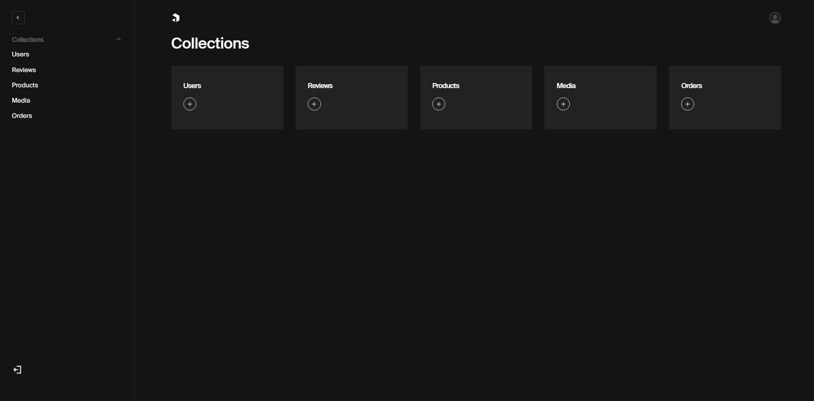
### Admin Create Product
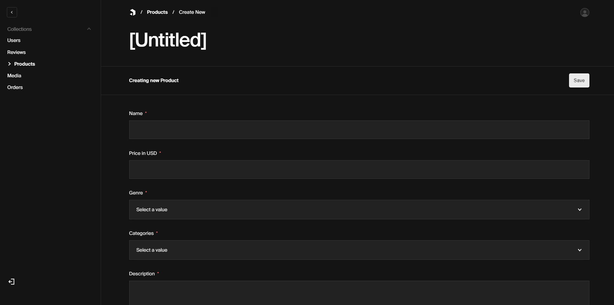
### Admin Add Image
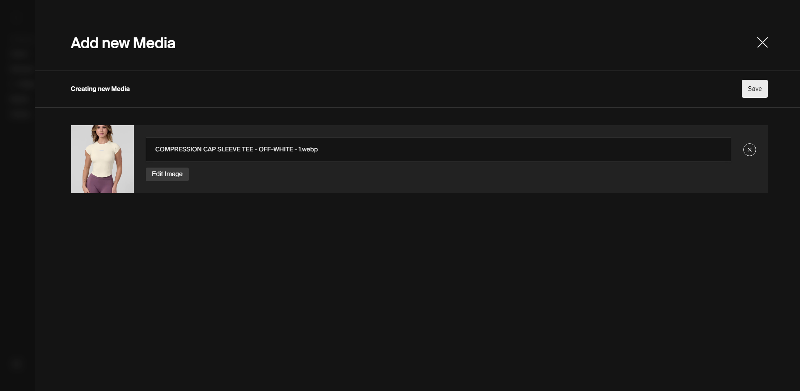
### Admin Create Product - 2

### Admin Products
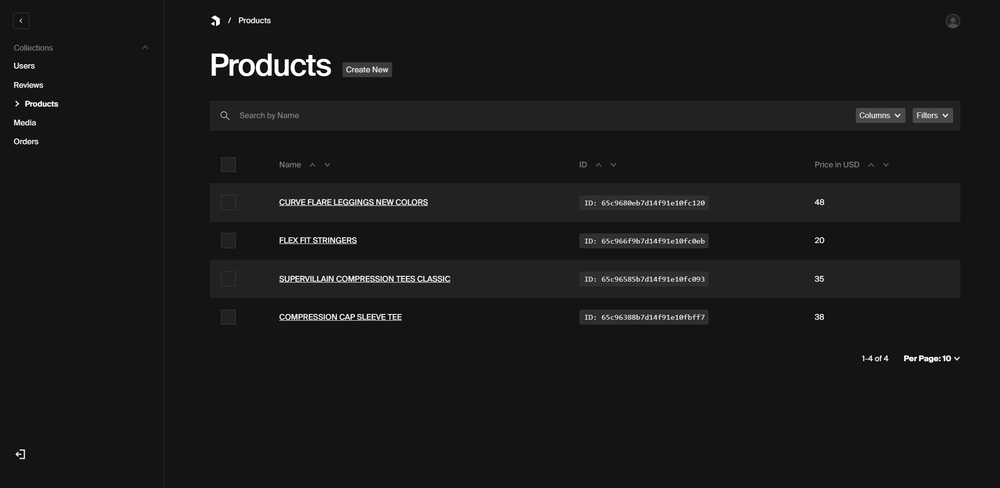

